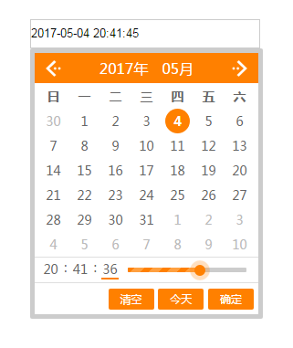

# flexDate
自定义了一款新新的可爱的时间控件，兼容ie8+
##  预览

## 示例
[点击跳转](http://wtjperi2003.oschina.io/flexdate/)
## 使用
### 引入css
```html
 <link rel="stylesheet" href="dist/css/flexDate.min.css">
```
### 引入js
```html
<script src="https://cdn.bootcss.com/jquery/1.12.4/jquery.min.js"></script>
<script src="dist/js/flexDate.min.js"></script>
```
### 调用
```javascript
//类方法设置本页面的皮肤颜色
FlexDate.setSkin('#ff8000');
var date=new FlexDate({
            e: '.flexDate1',
            format: 'yyyy-MM-dd HH:mm:ss',
            value: '2017-07-08 12:30:30',
            clearBtn: true,
            todayBtn: true,
            confirmBtn: true,
            min:'2017-07-01',
            max:new Date(),
            zIndex:999,
            bindClick:true,
            confirm: function (value) {}
        });
```
### 初始化参数

|  名称 |类型|默认值|说明|
|---|---|---|---|
|  e |  String |   |必填,文本框的jquery选择器   |
|  format |  String | yyyy-MM-dd HH:mm:ss |时间格式,跟随java.yyyy只显示年份,yyyy-MM则显示到月份,以此类推|
|  value |  String/Date |   | 文本框里默认显示的值,按format格式书写,可以是Date实例,new Date()表示今天 |
| clearBtn  | Boolean  | true  | 是否显示清空按钮 |
| todayBtn  | Boolean  |  true | 是否显示今天按钮 |
| confirmBtn  |  Boolean | true  | 是否显示确定按钮 |
| min  | String/Date  |   | 最小值,可以是Date实例,new Date()表示今天 |
| max  |  String/Date |   | 最大值,可以是Date实例,new Date()表示今天 |
| zIndex  |  Integer | 999  | 时间控件的层级 |
| bindClick  |  Boolean | true  | 是否对文本框进行点击事件的绑定 |
| confirm  | Function  |   | 确定选取时间后的事件,函数会传进被选取的时间 |

### 实例方法

|  名称 |参数|参考值|说明|
|---|---|---|---|
|show|  |   |显示时间控件    |
|hide|  |   |隐藏时间控件    |
|setMin|value|'2017-05-04'|设置该实例的最小日期,即小于该日期不能够被选取    |
|setMax|value|'2017-05-04'|设置该实例的最大日期,即大于该日期不能够被选取    |
|reset|format|'2017-05-04'|重置控件,根据format转变时间精度和时间格式    |

### 快速实例化

当文本框的class设置为flexDate的时候,控件会自动实例化,并根据文本框的属性做参数,如：

```html
    <input type="text" readonly class="flexDate" format="yyyy年MM月dd日" clearBtn="false" confirm="confirm"/>
```
其中confirm函数需在全局执行环境定义

## LICENSE
GPL-2.0